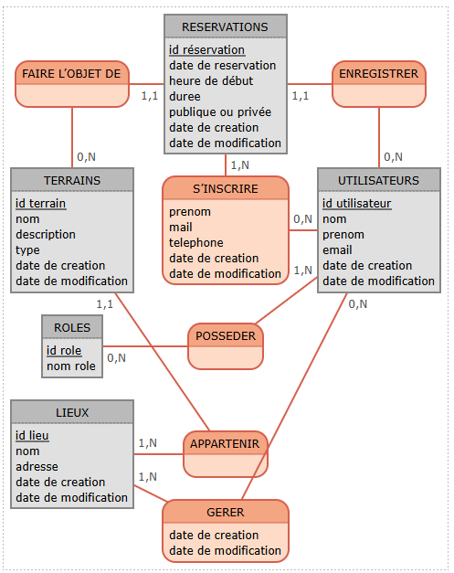

# API Rest

## API Rest conçu avec Java Spring Boot

### Permettant la gestion/réservation de court de padel, tennis ou squash.
### Différents rôles : joueur, gestionnaire, admin. Un gestionnaire peut créer des lieux et y associer des courts.
### Un joueur peut effectuer des réservations publiques ou privées, y ajouter des invités.
### D'autres joueurs peuvent se positionner sur des réservations publiques.
